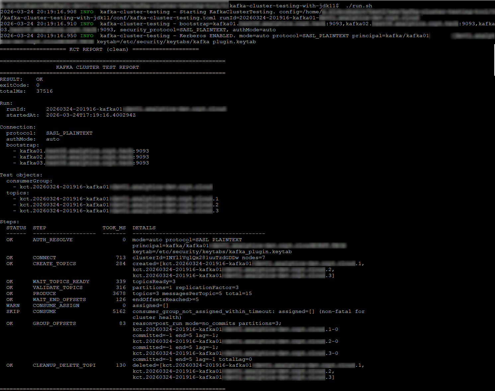

# Kafka Cluster Testing

Kafka Cluster Testing is a standalone CLI utility for deterministic engineering validation of an Apache Kafka cluster.

It is a smoke-test utility for cluster readiness and operational verification. It is not a monitoring platform and it is not a load-testing tool.

Supported Apache Kafka versions: `3.0.0` through `4.2.0`.

Project page:
- https://kafkakombat.com/kafka-cluster-testing

Related project:
- https://github.com/kafkakombat/kafkakombat

## Repository scope

This repository currently serves as the public project entry point for Kafka Cluster Testing.

It publishes:
- project overview
- public usage notes
- release references
- licensing and security information
- example output and report format

Runtime artifacts are published through the project website. The launcher script, packaged distribution, and runtime files are not stored in this repository at this stage.

## What the utility verifies

Kafka Cluster Testing checks that a Kafka cluster:
- is reachable over the network
- accepts client connections
- allows temporary topic creation
- durably stores produced data
- keeps topic metadata consistent
- allows best-effort reads through a consumer

## Typical use cases

- commissioning a new Kafka cluster
- ZooKeeper to KRaft migration validation
- Kafka version upgrade validation
- Kerberos and ACL verification
- dual-mode cluster validation

## Configuration overview

The runtime package published on the website contains the configuration file `kafka-cluster-testing.toml`.

In practice, the minimum input is usually:
- Kafka bootstrap servers
- and, for Kerberos-secured clusters, a valid principal and keytab

### Cluster without Kerberos

Use:
- `security_protocol = "PLAINTEXT"`
- `auth.mode = "none"`

### Cluster with Kerberos

Use:
- `security_protocol = "SASL_PLAINTEXT"` or `SASL_SSL`
- `auth.mode = "auto"` or `kerberos`
- valid `krb5.conf`, principal, and keytab

The project page contains the public runtime notes and release artifacts:
- https://kafkakombat.com/kafka-cluster-testing

## Running the utility

The packaged utility is launched from the downloaded distribution.

Typical usage:

```bash
./run.sh
```

With an explicit config path:

```bash
./run.sh /path/to/kafka-cluster-testing.toml
```

If you use the `kafka-cluster-testing-without-jdk11` distribution, Java 11 must already be available on the host and the launcher must point to that installation.

If you use the `kafka-cluster-testing-with-jdk11` distribution, JDK 11 is already included in the package.

## Output files

The runtime package produces:
- `out/run.log` — full execution log
- `out/report.txt` — clean human-readable and CI-friendly report
- `out/*.json` — structured report for automation

## Exit codes

- `0` — cluster is operational
- `2` — technical failure
- `3` — security or configuration failure

The shell exit code matches the report and JSON result.

## Example report

Below is a public example of the final protocol produced by the utility. Real hostnames were replaced with `example.com` values.



```text
====================================================================
                 KAFKA CLUSTER TEST REPORT
====================================================================
RESULT:    OK
exitCode:  0
totalMs:   36449

Run:
  runId:      20260323-202126-kafka01.example.com
  startedAt:  2026-03-23T17:21:26.493501Z

Connection:
  protocol:   SASL_PLAINTEXT
  authMode:   auto
  bootstrap:
    - kafka01.example.com:9093
    - kafka02.example.com:9093
    - kafka03.example.com:9093

Test objects:
  consumerGroup:
    - kct.20260323-202126-kafka01.example.com
  topics:
    - kct.20260323-202126-kafka01.example.com.1
    - kct.20260323-202126-kafka01.example.com.2
    - kct.20260323-202126-kafka01.example.com.3

Steps:
  STATUS  STEP                 TOOK_MS  DETAILS
  ------  -------------------  -------  ----------------------------------------
  OK      AUTH_RESOLVE               0  mode=auto protocol=SASL_PLAINTEXT
                                        principal=kafka/client01.example.com@EXAMPLE.COM
                                        keytab=/etc/security/keytabs/kafka-client.keytab
  OK      CONNECT                  829  clusterId=INYl1VqlQx281uuTzdGDDw nodes=7
  OK      CREATE_TOPICS            902  created=[kct.20260323-202126-kafka01.example.com.1,
                                        kct.20260323-202126-kafka01.example.com.2,
                                        kct.20260323-202126-kafka01.example.com.3]
  OK      WAIT_TOPICS_READY         47  topicsReady=3
  OK      VALIDATE_TOPICS           11  partitions=1 replicationFactor=3
  OK      PRODUCE                 1763  topics=3 messagesPerTopic=5 total=15
  OK      WAIT_END_OFFSETS         160  endOffsetsReached>=5
  WARN    CONSUME_ASSIGN             0  assigned=[]
  SKIP    CONSUME                 5087  consumer_group_not_assigned_within_timeout: assigned=[] (non-fatal for
                                        cluster health)
  OK      GROUP_OFFSETS            220  reason=post_run mode=no_commits partitions=3;
                                        kct.20260323-202126-kafka01.example.com.1-0
                                        committed=-1 end=5 lag=-1;
                                        kct.20260323-202126-kafka01.example.com.2-0
                                        committed=-1 end=5 lag=-1;
                                        kct.20260323-202126-kafka01.example.com.3-0
                                        committed=-1 end=5 lag=-1 totalLag=0
  OK      CLEANUP_DELETE_TOPI      377  deleted=[kct.20260323-202126-kafka01.example.com.1,
                                        kct.20260323-202126-kafka01.example.com.2,
                                        kct.20260323-202126-kafka01.example.com.3]

====================================================================
```

## Result interpretation

If the cluster:
- accepts connections
- creates test topics
- durably writes data

then the cluster is considered operational for smoke-test purposes.
Everything else is additional diagnostics.

## Public releases

Public release artifacts are published through the project website:
- https://kafkakombat.com/kafka-cluster-testing

This repository may later be expanded, but it currently does not serve as the runtime artifact distribution channel.

## License

AGPL-3.0. See `LICENSE` and `NOTICE`.
